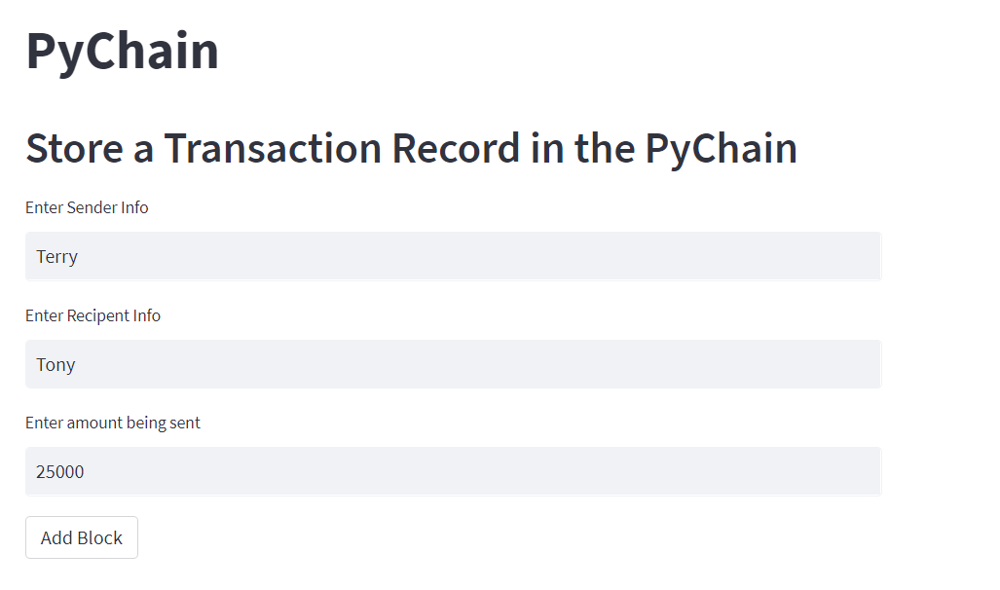
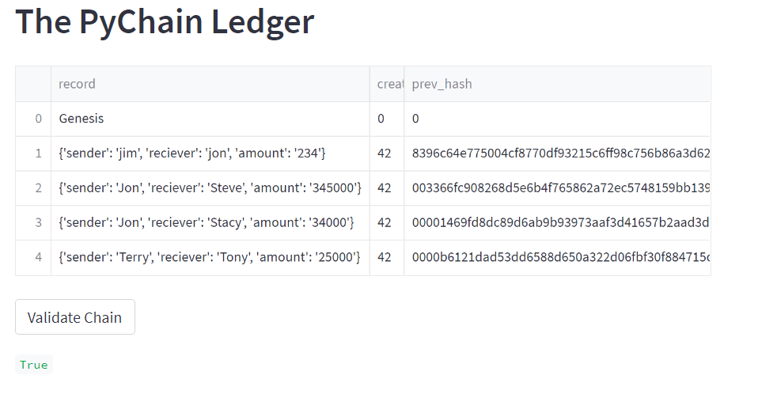
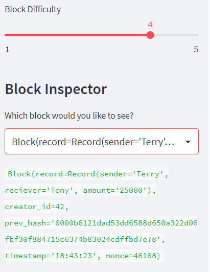

# blockchainLedger
UW Fintech Bootcamp Module 18 Challenge - Build a Blockchain Ledger

---

## Technologies

The following libraries are used in this analysis:  
  
  * streamlit  
  * dataclasses
  * typing
  * datetime
  * haslib
  * pandas
  
---

## Purpose of Program

The main purpose of this project is to demonstrate an ability to work with the pandas environment to create a pychain that records blocks, adds data to the blocks and allows for review of the data included within the block.  Streamlit is the software package used to demonstrate this skill, and the code was developed in visualstudio.    
  
---

## Examples

Through the use of streamlit I was able to capute key key data including the data entry: 
 
 
 
 
Additionally I was able to build a ledger :
  
  
  
And finally I developed a Block Inspector to verify the data included in the block:
  
  

Overall I can certainly see the value of developing these types of skills as they are certainly part of the future of fintech.  

---

## Contributors

The majority of this project has been done independently, with support from my tutor, Katy Kirby

---

## License

Program is free to use without license.  Only request is that you notify author of use and application.
  
To discuss usage or general inquires please contact the author at jonm5214@gmail.com